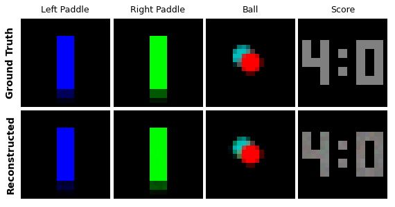
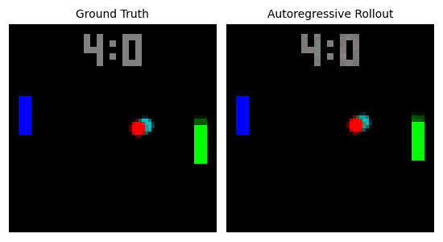

## Pong-OCWM

 &nbsp;&nbsp;&nbsp;&nbsp;  

### Description

Object-Centric World Models (OCWMs) learn object-level latent representations of the environment and predict their future states. In this implementation, we train a Variational Autoencoder (VAE) on ground-truth Pong object masks (ball, left paddle, right paddle, score), tokenize the objects’ latent representations along with their positions, and train a transformer to predict next-step latent object states given previous frames and actions. In particular, the transformer uses spatial (inter-object) attention within each frame, and causal attention over a temporal window of spatially contextualized object states. To improve the accuracy of long autoregressive rollouts, we train the transformer with self-forcing; that is; we optimize a temporally discounted sum of per-step losses over an autoregressive rollout during training.

The code for our Pong environment is based on the CITRIS Interventional Pong dataset [1], released under the BSD 3-Clause Clear License, with slight changes to increase simulation speed (e.g., rendering frames by directly writing into preallocated NumPy arrays rather than rebuilding full Matplotlib figures). The overall approach of using ground-truth object masks and encoding the ball’s velocity by including its previous position in the observation is based on the Interventional Pong experiments in SPARTAN [2].

[1] Lippe, P., Magliacane, S., Löwe, S., Asano, Y. M., Cohen, T., & Gavves, S. (2022). CITRIS: Causal Identifiability from Temporal Intervened Sequences. Proceedings of the 39th International Conference on Machine Learning (Vol. 162, pp. 13557–13603). PMLR. https://proceedings.mlr.press/v162/lippe22a.html

[2] Lei, A., Schölkopf, B., & Posner, I. (2025). SPARTAN: A Sparse Transformer World Model Attending to What Matters. The Thirty-Ninth Annual Conference on Neural Information Processing Systems. NIPS. https://openreview.net/forum?id=uS5ch7GjZ4

*TODO: model resets as binary latent variables or via multimodal output head; evaluate models with pixel MSE as a function of rollout length, rollout accuracy as a function of context window (W) and self-forcing horizon (H); add option to map keyboard inputs to paddle actions during rollout.*

### Repository Contents
- env/
  - `pong.py`: Pong simulation with configurable physics. AI-controlled paddles can be overridden with user actions {-1: down, 0: still, 1: up}.
- render/
  - `render.py`: Generate ground-truth object crops from game state and reconstruct full frames from crops and positions.
  - `animate.py`: Animation utilities for object crops and reconstructed frames.
- models/
  - `vae_model.py`: Convolutional Variational Autoencoder (C-VAE) for encoding object crops into a latent space.
  - `transformer_model.py`: Spatiotemporal transformer for predicting latent dynamics using inter-object attention, causal temporal attention, and RoPE.
- train/
  - `data_loader.py`: Collect the training data buffer used for both VAE and transformer model. 
  - `vae_train.py`: Batch sampler, BCE loss computation, and training loop for the VAE.
  - `transformer_train.py`: Batch sampler and autoregressive training loop for the transformer.
- eval (WIP)/
- examples/
  - `sim_and_render.py`: Run a Pong simulation and save as GIF.
  - `run_vae_train.py`: Train the VAE on ground-truth object crops.
  - `run_transformer_train.py`: Train the transformer on Pong trajectories using a frozen VAE.
