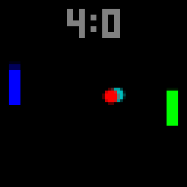

## Pong-OCWM

### Description

### Repository Contents
- env/
  - `pong_env.py`:
- render/
  - `render.py`:
  - `animate.py`: 
- models/
- train/
- eval/
- examples/
  - `sim_and_render.py`:
- assets/

